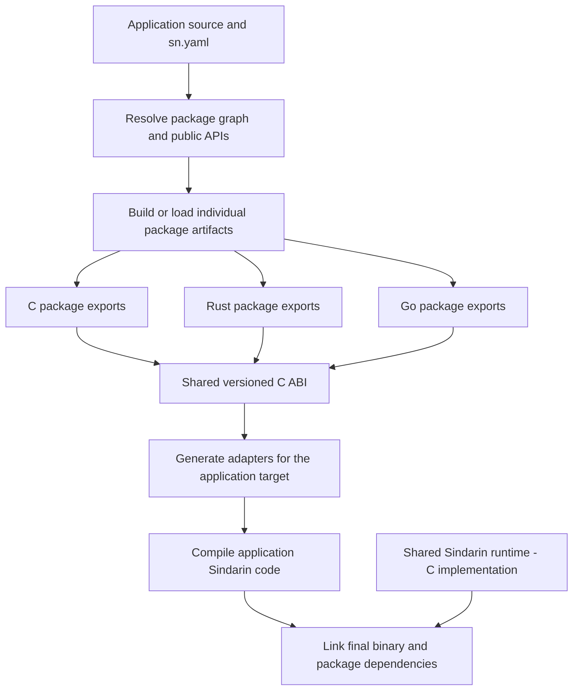

# Runtime and mixed-language package architecture

Status: agreed architectural direction, 2026-10-09. This is the reference for
implementation work, not a claim that package assemblies, automatic cross-language
adapters or the Go backend already exist. The runtime manifest field and import
compatibility checks are implemented; independent package compilation is pending.

## Decision

Sindarin applications choose a compilation target. Packages are independently
buildable units and may choose a different implementation runtime. A shared,
versioned C ABI connects the language runtime, package exports and generated
adapters. Native implementations keep their original language.

The canonical shared Sindarin runtime is implemented in C for now and must be
consumable from C, Rust and Go. This does not require three SDK implementations.
The actual SDK package can retain its C implementation behind the common ABI.
Target-specific bindings adapt values and calls; they do not duplicate SDK logic.

C remains the default target. Existing Sindarin syntax, public SDK API and C
behaviour must be preserved throughout implementation and migration.

## Terms

| Term | Meaning |
| --- | --- |
| Application target | Language/toolchain used to compile application Sindarin code: C, Rust or eventually Go |
| Shared Sindarin runtime | Common services and value/ownership contract; its canonical implementation is C |
| Package `runtime` | Compilation runtime chosen for that package's own Sindarin implementation |
| Native backing language | Language of a package's interop source files; compiled with that language's toolchain |
| Package assembly | Compiled package artifacts plus public API, ABI and build metadata |
| SDK package | Higher-level Sindarin APIs and implementations, distinct from the language runtime |
| Native libraries package | External dependencies such as json-c, OpenSSL and zlib |

An assembly here is a native package artifact, such as a static archive or shared
library, with accompanying metadata. This does not specify a CLR/.NET assembly
format or a new universal bytecode.

Selecting Rust describes how the application's Sindarin code is compiled. A Go
interop dependency can still bring its Go runtime into that application's process.
That runtime is distinct from the shared Sindarin runtime.

## Compilation architecture



1. Resolve imports and dependency versions and load public Sindarin declarations.
2. Determine the application target and each package's compilation runtime.
3. Build or select compatible package artifacts using their own native toolchains.
4. Export package entry points through the common ABI and generate importing
   adapters for the application's target.
5. Compile the application and link its adapters, package artifacts and runtime.
6. Validate required runtime initialization, shutdown and callback registration.

Package initialization is distinct from application `main`; dependencies must not
produce competing executable entry points. Exported symbols are namespaced by
package identity, and dependency initialization follows a documented graph order.

## sn.yaml runtime field

The supported manifest values are `C`, `RS` and `GO`:

```yaml
name: sindarin-pkg-sdk
version: 1.0.0
runtime: C
```

```yaml
name: rust-backed-package
version: 1.0.0
runtime: RS
```

```yaml
name: go-backed-package
version: 1.0.0
runtime: GO
```

`runtime` chooses how that package's Sindarin implementation is compiled. It does
not change the final application's target and does not translate foreign source
files into the selected language. Native sources also need explicit build inputs
and binding metadata; the exact schema for those fields remains implementation
work. For example, an RS package can still declare an explicit C dependency.

For a package consisting only of portable Sindarin source, an omitted runtime
inherits the application's target. Its artifact is therefore cached separately
for each target. An explicit runtime fixes the package artifact's implementation
runtime and consumers use generated ABI adapters.

Legacy manifests retain their current behaviour: C remains the default application
target, pure Sindarin imports follow the selected target, and existing C native
source/include/link directives remain C interop. Adding the new architecture must
not silently reinterpret or remove those directives.

The manifest parser validates and preserves `runtime`, including dependency add
and update operations. Omission is distinct from an explicit C selection. Runtime
values must match the spellings above; duplicate or malformed runtime declarations
produce errors. Nested extension metadata does not select a package runtime.

The compiler checks the manifests owning imported modules, including transitive,
relative and SDK imports, before code emission. Matching C/RS selections currently
use the existing source compilation path. Cross-runtime package imports report
that independent package artifacts and generated ABI adapters are not implemented
yet; GO imports report that the Go backend and native package bridge are pending.
These checks also apply with `--no-install` and source/model emission.

The application's CLI target remains independent of the runtime declared in its
own manifest; imports belonging to that same manifest follow the application
target. Existing native C directives keep their C backing language even for RS
packages. Independent artifacts, native build/binding metadata and Go package
builds remain required implementation work.

## Mixed-package example

A Sindarin application targeting Rust imports these dependencies:

| Dependency | Build behaviour |
| --- | --- |
| SDK, `runtime: C` | Build its Sindarin facade/native C implementation as a C package artifact |
| HTTP, pure Sindarin and no fixed runtime | Compile its Sindarin implementation into a Rust package artifact |
| Package with Rust backing | Compile Rust backing code with Rust and expose the declared common-ABI exports |
| Package with Go backing | Build Go code and a C-callable export bridge with Go |

The final application is compiled as Rust and consumes the package artifacts
through generated adapters. C, Rust and Go backing implementations are not
rewritten as Rust. This design also permits a C application to consume RS/GO
package artifacts through the same boundary.

Go's `c-archive` and `c-shared` modes build a bridge main package and its imported
packages, exposing cgo-exported functions. Multiple Go dependencies may need one
aggregate bridge/runtime build. Individually buildable package units do not imply
that arbitrary independent Go runtime archives can be linked together. Artifact
planning must preserve these toolchain constraints.

## Common runtime and package ABI

The common ABI must be explicit and versioned. It must define:

- Scalar widths, signedness, boolean/character representations and nil.
- Strings and buffers with their length, encoding and ownership rules.
- Array and record access, value-copy semantics, layout metadata where required,
  and opaque resource handles where internal layouts are private.
- Allocation, release, retain and destruction entry points, including which
  allocator owns returned memory.
- Borrowed versus transferred values, aliases and observable identity/lifetimes.
- Callback signatures, registration, userdata ownership, reentry and thread rules.
- Errors and panic boundaries, initialization/shutdown and ABI compatibility.

No Rust String/Vec/trait object or Go string/slice/interface representation becomes
part of the common binary contract merely by casting it. Runtime adapters use the
specified ABI representations and operations. Go/Rust object state retained by
foreign code needs valid handles or the explicitly supported lifetime protocol.

Language-visible behaviour must remain consistent, including evaluation order,
copy hooks, arithmetic modes, cleanup, aliases, nil and existing `sizeof`/identity
contracts. Backend-private layout can vary only where it is not observable through
those contracts. Foreign layouts are explicit ABI commitments.

Rust/Go backend support code remains necessary to adapt their emitted code to this
runtime. It must implement the common contract rather than invent incompatible
ownership rules. A Go dependency's garbage collector is not a substitute for
Sindarin's deterministic resource-cleanup rules.

## Automatic adapter generation

Adapters are generated from the package's public Sindarin declarations and its
ABI/ownership/binding metadata. Generate both the package export adapters and the
consumer import adapters as required. The consumer does not hand-write wrappers
for each dependency.

For native exports, metadata maps declared entry points to their backing symbols
and specifies the lifetime/ownership information that signatures alone cannot
express. Automatic generation is not arbitrary reflection over Rust/Go source:
unsupported or incomplete contracts must produce clear errors. Custom integration
hooks may be required for complex foreign APIs; their implementation stays in the
package's original language.

Same-language direct calls can be a later optimization. Correctness must first be
established through the shared ABI so target selection remains independent of a
package's implementation runtime.

## Package artifact metadata and final linking

An artifact carries public symbols/types, binding and ownership metadata, package
identity/version, shared-runtime ABI version, implementation runtime/toolchain,
platform/architecture, native link dependencies and initialization requirements.
Generic definitions or specializations must also be available where application
instantiation requires them; a native archive alone cannot represent every generic
or reflection requirement.

Build-cache keys include those properties and the required optimization/arithmetic
settings. The final linker checks compatibility, selects one compatible shared
Sindarin runtime instance, resolves transitive native libraries and reports missing
symbols, ABI mismatches or unavailable toolchains. Prebuilt artifacts can avoid
rebuilding native dependencies, provided their compatibility metadata agrees.

Go bindings require cgo and a compatible C toolchain on supported platforms.
Cross-compilation must coordinate every native dependency's architecture/toolchain;
selecting an application target does not make foreign packages portable by itself.

## Current SDK and migration

The current SDK contains public `.sn` modules and C `.sn.c` sidecars. Its C sources
use generated records and constructors such as `__sn__TextFile__new()`. The current
Rust backend already compiles native C code and generates private interop adapters;
it has not rewritten the SDK in Rust.

To produce reusable SDK/package artifacts, decouple SDK implementation from
per-application generated C declarations. Define the runtime/SDK ABI and preserve
compatibility adapters for the current C API, layouts, allocation and release
behaviour. Existing native fields must be inventoried as API-visible; underscore
names are not permission to remove them.

Migration sequence:

1. Define and test the shared runtime/package ABI and artifact metadata.
2. Add the runtime manifest field and native build-plan metadata while preserving
   legacy manifest parsing, serialization and C builds.
3. Prove one independently built SDK resource module consumed by C and Rust apps,
   with automatically generated adapters and unchanged Sindarin callers.
4. Prove Rust-native and Go-native dependency bridges. This can use small Go
   binding clients before a Go Sindarin backend exists.
5. Extend independent package compilation, caching and final linking to the SDK
   and wider package graph, preserving generic/type and ownership contracts.
6. Complete the remaining Rust language parity gaps and full platform/mode audits.
7. Implement and verify the Go Sindarin backend later against the same contracts.

This architecture is a build/package/runtime capability. It preserves the current
C default and language contract and does not require maintaining three complete
SDK implementations.

## Technical references

- [Rust C interoperability](https://doc.rust-lang.org/nomicon/ffi.html)
- [Rust library linkage](https://doc.rust-lang.org/reference/linkage.html)
- [Go library build modes](https://pkg.go.dev/cmd/go#hdr-Build_modes)
- [Go C interoperability and pointer rules](https://pkg.go.dev/cmd/cgo)
- [Go callback-state handles](https://pkg.go.dev/runtime/cgo#Handle)
